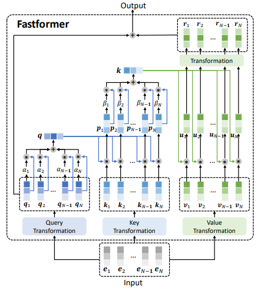

# Fastformer-PyTorch

Unofficial PyTorch implementation of Fastformer based on paper [Fastformer: Additive Attention Can Be All You Need](https://arxiv.org/abs/2108.09084).




## Usage :
```python
import torch
from Fastformer import Fastformer

model = Fastformer(dim = 3, decode_dim = 8)
x = torch.randn(4, 6, 3)
mask = torch.ones(1, 8).bool()
result = model(x, mask)
print(result.size())
```

## Citation :
```
@misc{wu2021fastformer,
    title={Fastformer: Additive Attention Can Be All You Need},
    author={Chuhan Wu, Fangzhao Wu, Tao Qi and Yongfeng Huang},
    year={2021},
    eprint={2108.09084v2},
    archivePrefix={arXiv},
    primaryClass={cs.CV}
}
```


### If this implement have any problem please let me know, thank you.